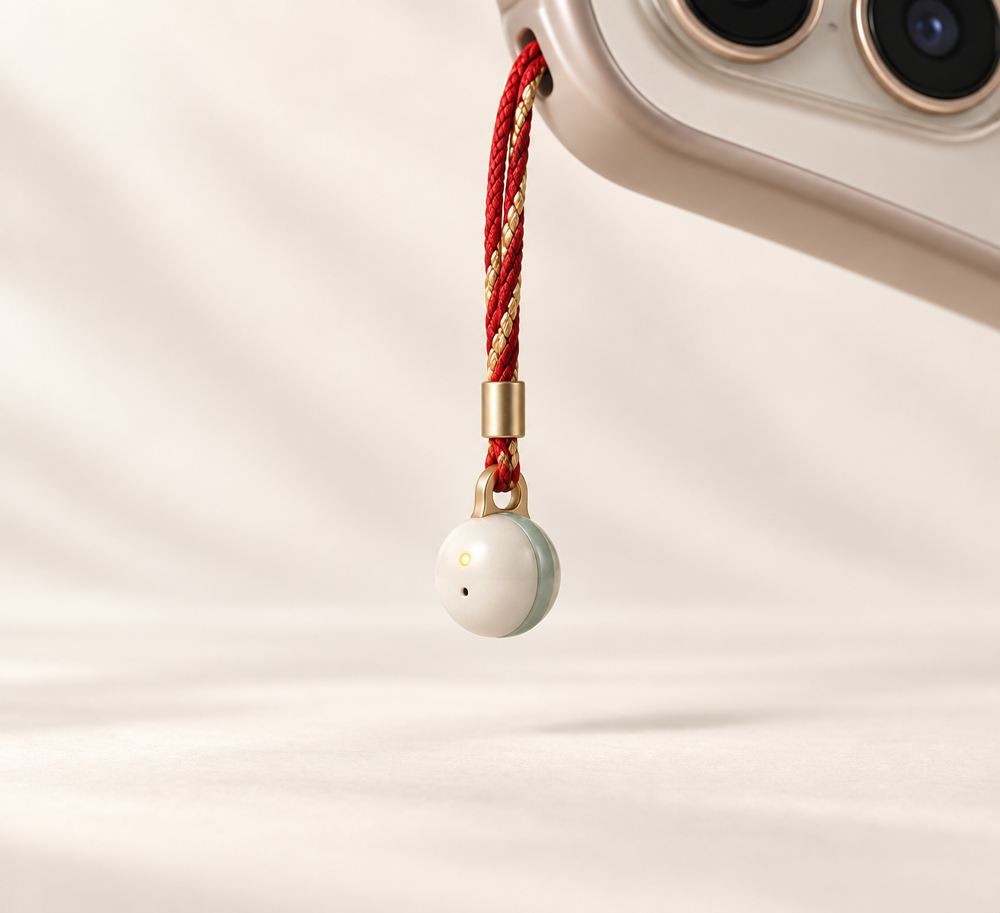
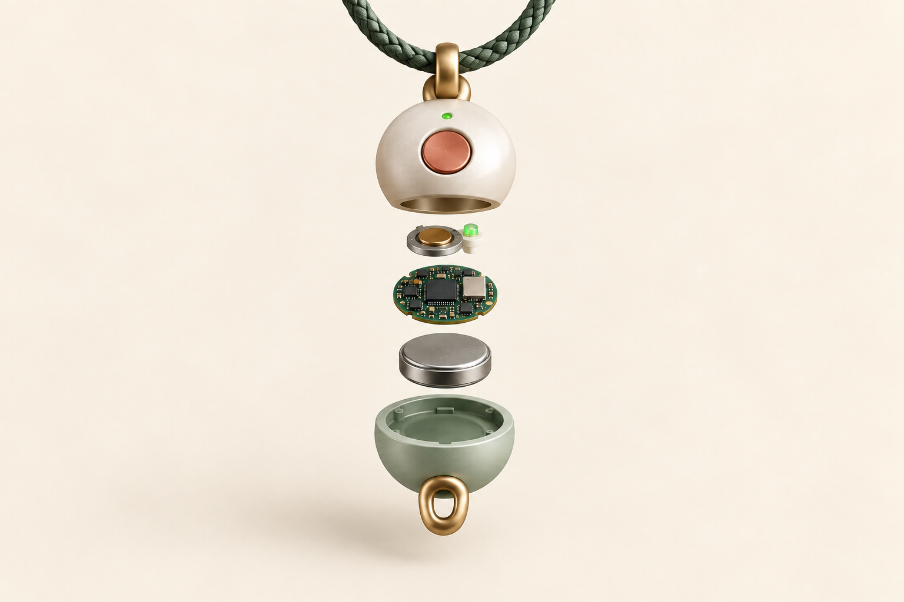

# Anker 首届黑客松挑战赛｜寻忆

> **把想起的那一刻，留成全家都能听懂的故事。**
>
> 一枚面向老人及其家庭的“地点感知式声音记忆载体”：用一颗手机挂坠大小的声音记忆珠，低门槛留下真实原声，再由 AI 自动整理为可回看、可倾听、可传承的生命故事。

## 1｜预赛信息卡

| 队名 | 【待补：队名】 | 赛道 | 智能录音 |
|---|---|---|---|
| 队长 | 【待补：姓名 / 邮箱 / 手机号】 | 成员与分工 | 【待补：2–4 人姓名、邮箱与分工】 |

### 评审先看

| 设备层 | 组织层 | 理解与表达层 |
|---|---|---|
| 一颗珠珠，一键录音；离线也能存 | 手机同步、故事卡、时间线、记忆地图 | 真声优先；AI 自动沉淀；共忆时给开放式追问 |

## 2｜赛题理解

智能录音不只解决“录音—转写—摘要—待办”。对家庭来说，最值得留下的往往是老人散步、探亲或聊天时突然想起的一句话：出现突然、讲述零散、稍纵即逝。

寻忆要解决的是：这段声音属于哪段人生经历、与谁有关、在哪里发生，以及以后什么时候值得再次被听见。

- **目标用户：**60 岁以上、需要低门槛操作的老人；以及购买、共忆、整理和回听的子女。
- **产品边界：**家庭回忆与数字生命故事工具，不是记忆测试、医疗诊断或治疗设备。
- **产品原则：**真声是事实底座；AI 在后台自动沉淀；用户可以让它忘记；家庭分享单独授权。

## 3｜产品方案

### 一句话定义

> 寻忆基于安克录音豆的可穿戴录音基础，把“记录一次谈话”升级为“连接一生故事”：一键记录、时间与可选地点锚点、AI 自动整理、家庭共忆。

### 两个真实场景

| 场景 A｜老人独自记录 | 场景 B｜老人 + 子女共忆 |
|---|---|
| 一键录音，离线保存时间与地点线索；回家连接手机后，AI 识别人、事、地点，合并多个片段，生成待确认故事卡、人生时间线和记忆地图。 | 手机连接后实时转写；子女控制节奏，AI 根据上下文召回相关记忆，只给一条开放式追问，帮助家人继续听、继续讲。 |

### 三层能力

**① 低门槛采集**　按一下开始/结束；灯光、震动和提示音让状态可感知；无手机也能先存。地点按次记录或关闭，不做持续轨迹。

**② AI 自动整理**　原声进入个人记忆库，AI 提取人物、地点、事件和来源证据；相似新片段自动补充，不覆盖旧原声；冲突信息保留为独立片段。

**③ 家庭共编**　用户选择后，故事才进入家庭空间；家人可继续补充照片、文字和新原声，形成可编辑的生命故事。

### 记忆工作方式

```text
原声片段层：录音 + 转写 + 时间/地点线索
        ↓ 后台自动整理
个人长期记忆：人物、事件、故事卡、来源证据、版本
        ↓ 用户按需分享
家庭共忆：相关记忆 + 一条开放式追问 + 继续讲述
```

示例故事卡：

> **第一次和爷爷看电影**
>
> 人物：奶奶、爷爷　｜　地点：旧电影院附近　｜　时间：未记录，不猜测
>
> 原声证据：“我第一次和你爷爷看电影，就是在这里……”
>
> 状态：AI 已自动沉淀；可播放原声、修改、加入家庭故事或让它忘记。

## 4｜创新与价值

1. **从一次谈话到一生故事：**跨时间、跨录音、跨家庭成员组织记忆。
2. **从单次摘要到自动生长：**AI 自动补充和召回，第二次讲述不必从零开始。
3. **真声可追溯：**任何摘要都能回到原声证据，AI 不覆盖原始表达。
4. **地点是记忆索引，不是监控：**一次性地点锚点可关闭，不保存完整行动轨迹。
5. **硬件愿意被长期携带：**缩小为手机挂绳上的一颗珠珠，像平安挂件而不是额外设备。

## 5｜24 小时 Demo 与 MVP

### Demo 演示路径

1. 老人按下声音记忆珠，录下：“我第一次和你爷爷看电影，就是在这里。”
2. 回到手机后，首页只提示“有一段声音，想带你回到一个地方”；用户轻触“收下这段声音”。
3. 地点、人物和旧片段分阶段浮现，最后与“第一次和爷爷看电影”的旧故事相认。
4. 用户进入故事页播放真实原声，并可展开查看每一段故事来自哪次讲述；AI 不补写不确定的年份。
5. 家人进入“一起听”，先听老人说完；停顿后，系统才递来一句可切换的开放式追问。

### MVP 取舍

| 现在做 | 下一步做 | 本轮不做 |
|---|---|---|
| 一键录音、离线保存、时间/可选地点锚点、手机同步、转写摘要、片段聚合、选择性家庭分享 | 实时追问、人物识别、那年今日、照片/文字补充、音频回忆录 | 公共声音地图、旅游社区、长时间 AI 闲聊、硬件摄像头 |

### Demo 说明

本 Demo 的录音入口明确归属于硬件珠珠：页面只展示珠珠连接状态、待同步原声和整理结果；“模拟珠珠按键（Demo）”仅用于演示硬件触发后的状态变化，不代表 App 直接收音。AI 结果为脚本化演示数据，不把模拟能力写成真实硬件接入或线上模型能力。打开 `寻忆-demo/index.html` 即可体验。

## 6｜硬件概念



*图 1｜单颗手机挂坠大小的声音记忆珠：约 10–12 mm，录音灯与麦克风孔可感知。*



*图 2｜概念拆解：外壳、按键/状态灯、麦克风、主板、电池、挂绳环；不含摄像头，GPS 由手机授权提供。*

| 设计判断 | 说明 |
|---|---|
| 体量 | 单颗珠珠，挂在手机或包上；不做大块设备 |
| 交互 | 一键开始/结束，灯光、震动、提示音反馈 |
| 隐私 | 录音状态可感知；地点可关闭；原声、转写、AI 记忆分开展示 |
| 记忆主权 | 老人拥有原声与故事；可修改、分享、撤回、导出、删除 |

## 7｜提交与来源

- **App Demo：**[打开寻忆 Demo](http://127.0.0.1:4173/%E5%AF%BB%E5%BF%86-demo/)
- **交付目录：**`寻忆-预赛提交包/`
- **产品定义依据：**《安克录音豆｜产品定义与功能全景》
- **模板依据：**《Anker 首届黑客松挑战赛 · 【填写队名】预赛材料》
- **参考：**[soundcore Work 官方产品页](https://www.soundcore.com/products/d3200-soundcore-work-ai-voice-recorder) · [中华人民共和国个人信息保护法](https://www.gov.cn/xinwen/2021-08/21/content_5632486.htm)
